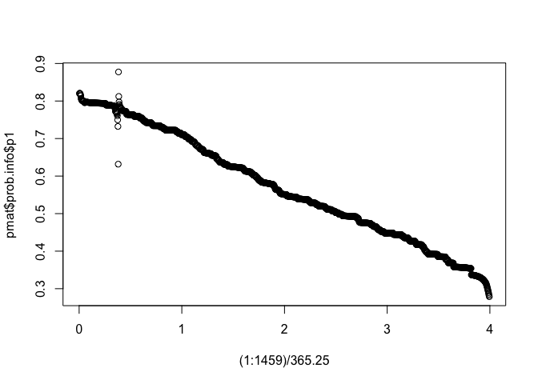

<!-- README.md is generated from README.Rmd. Please edit that file -->

# cwcens

<!-- badges: start -->

<!-- badges: end -->

This pacakage implements non-parametric estimation via a kernel
estimator for the probability in state and restricted mean time in state
in an illness-death model under component-wise censoring. Component-wise
censoring arises when illness can only be measured at a finite set of
times, while death is right censored and thus observed continuously up
to the right censoring time. Component-wise censored composite endpoints
arise often in biostatistical practice. For example, in many oncology
studies, progression-free survival is component-wise censored.

## Installation

You can install the development version of cwcens from
[GitHub](https://github.com/) with:

``` r
# install.packages("devtools")
devtools::install_github("anneae/cwcens")
```

## Irreversible Illness-Death Model Example

First, we will simulate data from a reversible illness-death model. Our
dataset will contain 200 patients. Visits are scheduled every six months
up to four years, and actual visit times are scattered around the
scheduled visit times according to a normal distribution with a standard
deviation of 10 days.

``` r
library(cwcens)
irrevdat <- simdat(200, scale12=1/.0008, scale13=1/.0002, scale23=1/.0016,
       scale21=1/.0008, vital.lfu=c(30.4*36, 30.4*48),
       visit.schedule = 30.4*c(12, 24, 36, 48), scatter.sd=10, 
       seed = 123)

head(irrevdat)
#>       dtime dstatus state2obs laststate1       t1       t2       t3 t4 x1 x2 x3
#> 1 1257.6632       0       Inf   1098.619 366.2642 730.8503 1098.619 NA  1  1  1
#> 2 1435.7722       0       Inf   1098.825 387.8506 722.5368 1098.825 NA  1  1  1
#> 3  298.6501       1       Inf      0.000       NA       NA       NA NA NA NA NA
#> 4  414.0724       1  361.7453      0.000 361.7453       NA       NA NA  2 NA NA
#> 5  136.8661       1       Inf      0.000       NA       NA       NA NA NA NA NA
#> 6 1275.2804       0       Inf   1092.912 379.9240 741.2849 1092.912 NA  1  1  1
#>   x4 nvisits
#> 1 NA       4
#> 2 NA       4
#> 3 NA       4
#> 4 NA       4
#> 5 NA       4
#> 6 NA       4
```

The dataset `irrevdat` records the time that each visit occurred and the
individual’s current state at each visit. For example, the individual in
the first row of `irrevdat` had visits at 366.2641718, 730.8503388 and
1098.6188469 days, and their state at those visits was 1, 1 and 1,
respectively, meaning they were still in state 1 (alive and
illness-free) at the third vist. The individual was right censored at
time 1257.6631792.

We can estimate the probability of being in each state at 4 years with
the following code:

``` r
kernel.est(irrevdat, bandwidth = 30.4*12, tau2 = 30.4*48, prob.times = 30.4*48)
#> $prob.info
#>     time        p1        p2        p3
#> 1 1459.2 0.2780514 0.2061952 0.5157534
```

We estimate that an individual will be alive and illness-free at 4 years
with probability 0.278, alive with illness with probability 0.206, and
dead with probability 0.516.

Below, we estimate the probability of being in each state over time (at
1, 2, …, 1459 days), and plot the results.

``` r
pmat<-kernel.est(irrevdat, bandwidth = 30.4*12, tau2 = 30.4*48, prob.times = 1:1459)
head(pmat$prob.info)
#>   time        p1        p2 p3
#> 1    1 0.8199693 0.1800307  0
#> 2    2 0.8208835 0.1791165  0
#> 3    3 0.8202317 0.1797683  0
#> 4    4 0.8186113 0.1813887  0
#> 5    5 0.8159012 0.1840988  0
#> 6    6 0.8135817 0.1864183  0
plot((1:1459)/365.25, pmat$prob.info$p1)
```

 Note
that the first curve is the event-free survival curve.

The standard approach to calculating illness-free survival for this type
of data uses the first time illness is *observed* as the date it
occurred. If illness was not observed at a visit, the standard approach
assumes it did not happen. Thus the

The kernel approach does not …

## Reversible Illness-Death Model Example

Since `scale21` is greater than zero, the true model is reversible,
meaning individuals can transition back to the illness-free state (state
1) from the alive with illness state (state 2).

``` r
revdat <- simdat(150, scale12=1/.0008, scale13=1/.0002, scale23=1/.0016,
       scale21=1/.0008, vital.lfu=c(30.4*36, 30.4*48),
       visit.schedule = 30.4*c(12, 24, 36, 48), scatter.sd=10, 
       seed = 111)

head(revdat)
#>      dtime dstatus state2obs laststate1       t1       t2       t3 t4 x1 x2 x3
#> 1 1397.254       1  740.1589   350.6542 350.6542 740.1589 1086.624 NA  1  2  1
#> 2  877.217       1  720.4429   365.2567 365.2567 720.4429       NA NA  1  2 NA
#> 3 1425.182       0       Inf  1101.6919 368.8910 720.4172 1101.692 NA  1  1  1
#> 4 1112.915       0 1082.0124   732.0686 354.2395 732.0686 1082.012 NA  1  1  2
#> 5 1125.034       0       Inf  1092.7008 364.1536 746.8926 1092.701 NA  1  1  1
#> 6 1430.074       1       Inf  1084.5604 369.3234 722.6714 1084.560 NA  1  1  1
#>   x4 nvisits
#> 1 NA       4
#> 2 NA       4
#> 3 NA       4
#> 4 NA       4
#> 5 NA       4
#> 6 NA       4
```

The individual in the first row of `revdat` had visits at 350.6541716,
740.1589203 and 1086.6241843 days, and their state at those visits was
1, 2 and 1, respectively, meaning that illness developed between the
first and second visit, and the illness cleared up between the second
and third visit. The individual then died at time 1397.253846.

What is special about using `README.Rmd` instead of just `README.md`?
You can include R chunks like so:

``` r
summary(cars)
#>      speed           dist       
#>  Min.   : 4.0   Min.   :  2.00  
#>  1st Qu.:12.0   1st Qu.: 26.00  
#>  Median :15.0   Median : 36.00  
#>  Mean   :15.4   Mean   : 42.98  
#>  3rd Qu.:19.0   3rd Qu.: 56.00  
#>  Max.   :25.0   Max.   :120.00
```

You’ll still need to render `README.Rmd` regularly, to keep `README.md`
up-to-date.

You can also embed plots, for example:


In that case, don’t forget to commit and push the resulting figure
files, so they display on GitHub\!
