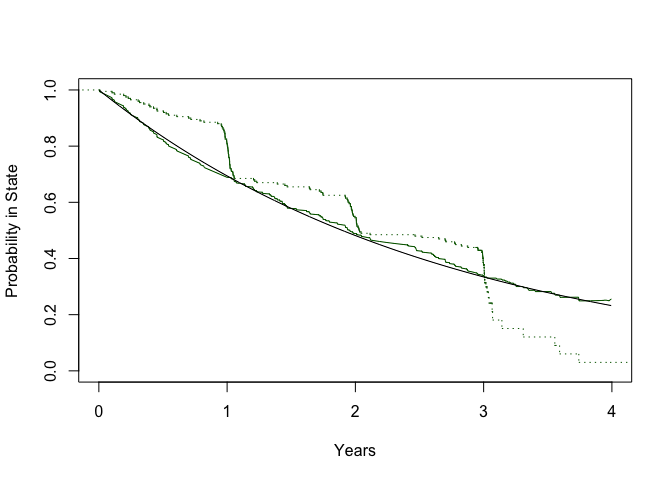

<!-- README.md is generated from README.Rmd. Please edit that file -->

# cwcens

<!-- badges: start -->

<!-- badges: end -->

This package implements non-parametric estimation via a kernel estimator
for the probability in state and restricted mean time in state in an
illness-death model under component-wise censoring. Component-wise
censoring arises when illness can only be measured at a finite set of
times, while death is right censored and thus observed continuously up
to the right censoring time. Component-wise censored composite endpoints
arise often in biostatistical practice. For example, in many oncology
studies, progression-free survival is component-wise censored. Many
articles in the literature describe the bias and “bumpy” Kaplan-Meier
curves that can result from applying standard survival methods to
component-wise censored data.

## Installation

You can install the development version of cwcens from
[GitHub](https://github.com/) with:

``` r
# install.packages("devtools")
devtools::install_github("anneae/cwcens")
#> Skipping install of 'cwcens' from a github remote, the SHA1 (0102768b) has not changed since last install.
#>   Use `force = TRUE` to force installation
```

## Irreversible Illness-Death Model Example

First, we will simulate data from an irreversible illness-death model
(that is, a model where backwards transitions are not allowed).


Our simulated dataset will contain 200 patients. Visits are scheduled
every six months up to four years, and actual visit times are scattered
around the scheduled visit times according to a normal distribution with
a standard deviation of 10 days. Right censoring time for death is
generated from a uniform distribution on the interval from 36 to 48
months. Setting `scale12 = NULL` means 1 to 2 transitions are not
allowed (so the true multistate model is irreversible). The default
values of `shape12`, `shape13` and `shape23` are 1, which implies that
all transition intensities are constant over time.

``` r
library(cwcens)

irrevdat <- simdat(200, scale12=1/.0008, scale13=1/.0002, scale23=1/.0016,
       scale21=NULL, vital.lfu=c(30.4*36, 30.4*48),
       visit.schedule = 30.4*c(12, 24, 36, 48), scatter.sd=10, 
       seed = 123)

head(irrevdat)
#>       dtime dstatus state2obs laststate1       t1       t2       t3 t4 x1 x2 x3
#> 1 1180.9414       0       Inf  1097.9628 364.0644 740.3401 1097.963 NA  1  1  1
#> 2  191.8389       1       Inf     0.0000       NA       NA       NA NA NA NA NA
#> 3 1176.7786       0       Inf  1102.9520 358.4525 729.2667 1102.952 NA  1  1  1
#> 4  499.9653       1  364.5116     0.0000 364.5116       NA       NA NA  2 NA NA
#> 5  656.5566       1  371.5070     0.0000 371.5070       NA       NA NA  2 NA NA
#> 6  637.7663       1       Inf   348.2945 348.2945       NA       NA NA  1 NA NA
#>   x4 nvisits
#> 1 NA       4
#> 2 NA       4
#> 3 NA       4
#> 4 NA       4
#> 5 NA       4
#> 6 NA       4
```

The dataset `irrevdat` records the time that each visit occurred and the
individual’s current state at each visit. For example, the individual in
the first row of `irrevdat` had visits at 364.06, 740.34 and 1097.96
days, and their state at those visits was 1, 1 and 1, respectively,
meaning they were still in state 1 (alive and illness-free) at the third
visit. The individual was right censored at time 1180.94.

We can estimate the probability of being in each state at 4 years with
the following code:

``` r
PIS<-kernel.est(irrevdat, bandwidth = 30.4*12, tau2 = 30.4*48, prob.times = 30.4*48,
                boundary = 'interpolation')
PIS
#> $prob.info
#>     time        p1        p2        p3
#> 1 1459.2 0.2568814 0.1524123 0.5907063
```

We estimate that an individual will be alive and illness-free at 4 years
with probability 0.257, alive with illness with probability 0.152, and
dead with probability 0.591.

We can estimate the restricted mean time in each state in the first 4
years with the following code:

``` r
RMTISdays<-kernel.est(irrevdat, bandwidth = 30.4*12, tau2 = 30.4*48, mu.times = 30.4*48,
                boundary = 'interpolation')
RMTISdays
#> $mu.info
#>     time      mu1      mu2     mu3
#> 1 1459.2 775.4122 251.1048 432.683
RMTISyears<-kernel.est(irrevdat, bandwidth = 30.4*12, tau2 = 30.4*48, mu.times = 30.4*48,
                boundary = 'interpolation', scale=12*30.4)
RMTISyears
#> $mu.info
#>   time      mu1       mu2      mu3
#> 1    4 2.125582 0.6883355 1.186083
```

We estimate that an individual will spend 2.13 years (775 days) in state
1, 0.69 years (251 days) in state 2, and 1.19 years (433 days) in state
3, on average, out of the first 4 years.

Below, we estimate the probability of being in each state over time
(specifically, each day up to 1459 days or 4 years), and plot the
results.

``` r
pmat<-kernel.est(irrevdat, bandwidth = 30.4*12, tau2 = 30.4*48, prob.times = 1:1459, boundary = 'interpolation')
head(pmat$prob.info)
#>   time        p1           p2    p3
#> 1    1 0.9993932 0.0006068061 0.000
#> 2    2 0.9987864 0.0012136123 0.000
#> 3    3 0.9931887 0.0018113163 0.005
#> 4    4 0.9925849 0.0024150884 0.005
#> 5    5 0.9919811 0.0030188606 0.005
#> 6    6 0.9913774 0.0036226327 0.005
plot((1:1459)/365.25, pmat$prob.info$p1, type = 'l', col = 'dark green', 
     xlab = 'Years', ylab = 'Probability in State', ylim = c(0,1))
lines((1:1459)/365.25, pmat$prob.info$p2, col = 'goldenrod')
lines((1:1459)/365.25, pmat$prob.info$p3, col = 'red')
```

 The
green, yellow and red lines represent the probability of being alive and
illness-free, alive with illness, and dead, over time.

Note that the green curve represents the probability of not having
experienced a composite endpoint consisting of death and illness, which
is something we often want to estimate in clinical studies. A common
approach for estimating the illness-free survival probability in this
setting is to apply the Kaplan-Meier estimator to the observed data.
That is, treat the first time illness is *observed* at a visit as the
date it actually occurred, and if illness was not observed at a visit,
assume illness did not occur. Then, calculate the (possibly right
censored) time to the earlier of illness or death for each person and
apply the Kaplan-Meier estimator.

The following code implements this “standard” approach and plots the
resulting curve (green dotted line) along with the curve estimated with
the kernel estimator (green solid line) and the true probability of
being alive and illness-free based on the simulation parameters (black
solid line).

``` r
library(survival)
etime <- ifelse(irrevdat$state2obs<Inf, irrevdat$state2obs, 
                ifelse(irrevdat$dstatus==1, irrevdat$dtime, irrevdat$laststate1))
event <- ifelse(irrevdat$state2obs<Inf, 1, irrevdat$dstatus)

kmest <- survfit(Surv(etime, event)~1)
kmest
#> Call: survfit(formula = Surv(etime, event) ~ 1)
#> 
#>       n  events  median 0.95LCL 0.95UCL 
#>     200     138     741     722    1091

plot((1:1459)/365.25, pmat$prob.info$p1, type = 'l', col = 'dark green', 
     xlab = 'Years', ylab = 'Probability in State', ylim = c(0,1))
lines(stepfun(kmest$time/365.25, c(1,kmest$surv)), col = 'dark green', 
      do.points= F, lty = 3)
lines((1:1459)/365.25, pexp((1:1459), rate = 0.0002+0.0008, lower.tail = F))
```



The standard approach leads to a curve with noticeable drops around the
time of scheduled visits (i.e. at 1, 2, 3 and 4 years) since illness is
first *observed* around those times in many patients. In addition, when
using the standard approach, we right censored people without observed
death or illness at the time of last visit. This means that the number
at risk is low after \~3 years, and it forces the survival curve to drop
to zero over the observed followup period. Meanwhile, the kernel
approach yields more plausible estimates. The kernel approach takes into
account the fact that visits offer a “snapshot” of current illness
status and the associated uncertainty about the exact time that illness
developed.

## Reversible Illness-Death Model Example

Next, we will simulate and analyze data from a reversible illness-death
model. In a reversible model, a patient’s illness can resolve, so
transitions back to the illness-free state (state 1) from the illness
state (state 2) are allowed.


When the `scale21` parameter in the `simdat` function is greater than
zero, data is simulated under a reversible model.

``` r
revdat <- simdat(150, scale12=1/.0008, scale13=1/.0001, scale23=1/.0008,
       scale21=1/.0016, vital.lfu=c(30.4*36, 30.4*48),
       visit.schedule = 30.4*c(12, 24, 36, 48), scatter.sd=10, 
       seed = 111)

head(revdat)
#>      dtime dstatus state2obs laststate1       t1       t2       t3 t4 x1 x2 x3
#> 1 1403.787       0  740.1589   350.6542 350.6542 740.1589 1086.624 NA  1  2  1
#> 2 1180.551       0  720.4429   365.2567 365.2567 720.4429 1091.562 NA  1  2  2
#> 3 1425.182       0       Inf  1101.6919 368.8910 720.4172 1101.692 NA  1  1  1
#> 4 1112.915       0 1082.0124   732.0686 354.2395 732.0686 1082.012 NA  1  1  2
#> 5 1125.034       0       Inf  1092.7008 364.1536 746.8926 1092.701 NA  1  1  1
#> 6 1436.733       0       Inf  1084.5604 369.3234 722.6714 1084.560 NA  1  1  1
#>   x4 nvisits
#> 1 NA       4
#> 2 NA       4
#> 3 NA       4
#> 4 NA       4
#> 5 NA       4
#> 6 NA       4
```

The individual in the first row of `revdat` had visits at 350.65, 740.16
and 1086.62 days, and their state at those visits was 1, 2 and 1,
respectively, meaning that the patient developed the illness between the
first and second visit, and the illness cleared up between the second
and third visit. The individual was then right censored at time 1403.79.

We next estimate and plot the probability of being in each state over
time:

``` r
pmat<-kernel.est(revdat, bandwidth = 30.4*12, tau2 = 30.4*48, prob.times = 1:1459, boundary = 'interpolation')
head(pmat$prob.info)
#>   time       p1           p2 p3
#> 1    1 0.999612 0.0003880065  0
#> 2    2 0.999224 0.0007760131  0
#> 3    3 0.998836 0.0011640196  0
#> 4    4 0.998448 0.0015520261  0
#> 5    5 0.998060 0.0019400327  0
#> 6    6 0.997672 0.0023280392  0
plot((1:1459)/365.25, pmat$prob.info$p1, type = 'l', col = 'dark green', 
     xlab = 'Years', ylab = 'Probability in State', ylim = c(0,1))
lines((1:1459)/365.25, pmat$prob.info$p2, col = 'goldenrod')
lines((1:1459)/365.25, pmat$prob.info$p3, col = 'red')
```


Finally, we will use the Aalen-Johansen estimator for multistate models,
implemented in the `survival` package, and compare the results to the
results from the kernel estimator. Like the Kaplan-Meier estimator, the
Aalen-Johansen estimator is not intended for component-wise censored
data. With component-wise censoring, we don’t observe the actual times
of transitions between states. If a person is in one state at a given
visit, and in a different state at the next visit, we only know a
transition occurred sometime between those two visits. To apply the
Aalen-Johansen estimator, we will assume that the transition actually
occurred at the time of the second visit, when the new state was first
observed. The following code makes a long dataset with counting process
structure, which will be the input when we use `survfit` to get the
Aalen-Johnasen estimates.

``` r
revdat$id<-1:nrow(revdat)
revdat_long <- data.frame(id = revdat$id, tstart=0, 
                          tstop = ifelse(!is.na(revdat[,'t1']), 
                                         revdat[,'t1'], revdat$dtime),
                          event = ifelse(!is.na(revdat[,'t1']), 
                                         revdat[,'x1'], revdat$dstatus*3))
for(j in 2:revdat$nvisits[1]){
  revdat_long <- rbind(revdat_long, 
          data.frame(id = revdat$id, tstart=revdat[,paste('t',j-1,sep ='')], 
          tstop = ifelse(!is.na(revdat[,paste('t',j, sep='')]),  
                        revdat[,paste('t',j, sep='')],
                        ifelse(revdat$dstatus==1, 
                               revdat$dtime, revdat[,paste('t',j-1,sep ='')])),
          event = ifelse(!is.na(revdat[,paste('t',j, sep='')]),  
                        revdat[,paste('x',j, sep='')],revdat$dstatus*3)))
}

revdat_long<-rbind(revdat_long, data.frame(id = revdat$id, 
                tstart= revdat[,paste('t', revdat$nvisits[1], sep ='')],
                tstop = ifelse(revdat$dstatus==1, revdat$dtime,
                              revdat[,paste('t',revdat$nvisits[1], sep ='')]) , 
                event = revdat$dstatus*3))

revdat_long <- revdat_long[!is.na(revdat_long$tstart) & revdat_long$tstop > revdat_long$tstart, ]
revdat_long <- revdat_long[order(revdat_long$id, revdat_long$tstart),]
revdat_long$event<- factor(revdat_long$event, 0:3, labels=c("censor", "(s0)","st2", "st3"))
    
head(revdat_long)
#>     id   tstart     tstop event
#> 1    1   0.0000  350.6542  (s0)
#> 151  1 350.6542  740.1589   st2
#> 301  1 740.1589 1086.6242  (s0)
#> 2    2   0.0000  365.2567  (s0)
#> 152  2 365.2567  720.4429   st2
#> 302  2 720.4429 1091.5619   st2
```

Below, we calculate the Aalen-Johansen estimates of the probability in
state and restricted mean time in state, and plot the probability in
state estimates along with the estimates from the kernel estimator. The
green, yellow and red lines correspond to states 1, 2 and 3, and the
dotted lines represent the Aalen-Johansen estimator while the solid
lines represent the kernel estimator.

``` r
ajest <- survfit(Surv(tstart, tstop, as.factor(event))~1, id = id, dat = revdat_long, influence=T)
ajest
#> Call: survfit(formula = Surv(tstart, tstop, as.factor(event)) ~ 1, 
#>     data = revdat_long, id = id, influence = T)
#> 
#>        n nevent     rmean std(rmean)*
#> (s0) 434     20 1009.8946    41.95616
#> st2  434     64  150.0927    19.46973
#> st3  434     37  282.9901    39.30645
#>    *mean time in state, restricted (max time = 1442.977 )

plot((1:1459)/365.25, pmat$prob.info$p1, type = 'l', col = 'dark green', 
     xlab = 'Years', ylab = 'Probability in State', ylim = c(0,1))
lines((1:1459)/365.25, pmat$prob.info$p2, col = 'goldenrod')
lines((1:1459)/365.25, pmat$prob.info$p3, col = 'red')
lines(stepfun(ajest$time/365.25, c(1,ajest$pstate[,1])), 
      col = 'dark green', do.points = F, lty = 3)
lines(stepfun(ajest$time/365.25, c(0,ajest$pstate[,2])), 
              col = 'goldenrod',  do.points = F, lty = 3)
lines(stepfun(ajest$time/365.25, c(0,ajest$pstate[,3])), 
              col = 'red', do.points = F, lty = 3)
```


The kernel estimator yields more plausible results than the
Aalen-Johansen estimator, which ignores component-wise censoring.
